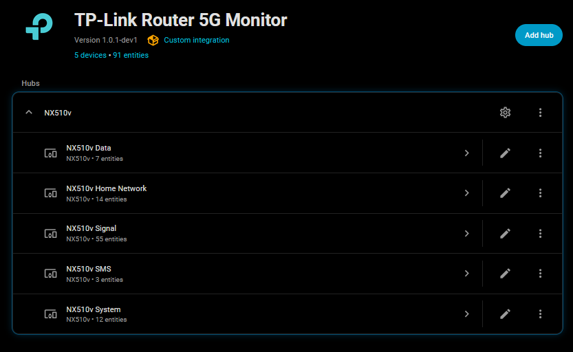
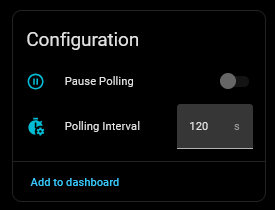
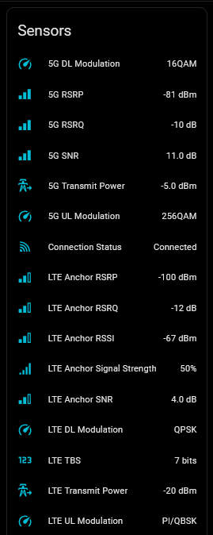
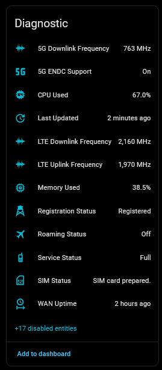
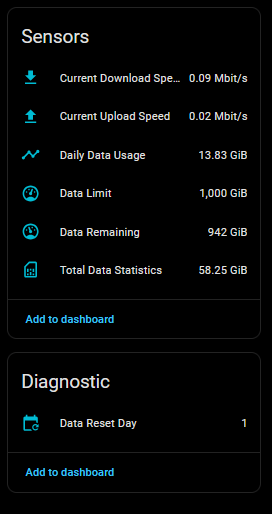
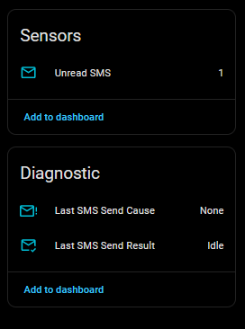

# TP-Link Router 5G Monitor for Home Assistant

      

A Home Assistant integration specifically designed for the **TP-Link NX510v 5G Router**. This component provides extensive signal diagnostics and data tracking.

> [!NOTE] This project extends the excellent work of [AlexandrErohin/home-assistant-tplink-router](https://github.com/AlexandrErohin/home-assistant-tplink-router). It is optimized to provide 5G/LTE metrics.

- If you have an NX510v and want to closely monitor your connection, this integration is for you!
- If you are looking for a general TP-Link Router integration [TP-Link Router](https://github.com/AlexandrErohin/home-assistant-tplink-router) is highly recommended.

## 🔧 Compatibility & Requirements

**Router Hardware:**

- **Supported**: **TP-Link NX510v** – TP-Link Aginet AX3000 5G Indoor Router with WiFi 6
  - _May work with other TP-Link 5G devices, but has only been tested with NX510v_
- **Potentially Compatible**: Other TP-Link 5G routers using the Aginet firmware.
- **Not Supported**: Non-TP-Link hardware or older TP-Link models without 5G.

**Network:**

- Local network access to the router is required.

**Home Assistant Version:**

- Minimum: Home Assistant **2025.1**

---

## ✅ Features

### 📡 Advanced 5G/LTE Diagnostics

- **Detailed Signal Metrics**: RSRP, RSRQ, RSSI, and SNR for both the 5G (NR) and the LTE Anchor cell.
- **RF Engineering Data**: Monitor CQI, Modulation (up to 256QAM), MCS, Resource Blocks, and Transmit Power.
- **Frequency Tracking**: Identify active 5G/LTE bands and ARFCN channels.

### 📊 Comprehensive Monitoring

- **Sub-Device Organization**: Entities are automatically grouped into logical devices: **Main Router**, **Data Usage**, **SMS**, **Wi-Fi**, and **Clients**.

### 📋 Essential Router Management (per original integration)

- **Data Usage Tracking**: Real-time daily and monthly usage, monthly limits, remaining data
- **Router Management**: Reboot control, WiFi control switches
- **Connected Clients**: Total count, breakdown by connection type (WiFi/Wired)
- **Basic SMS Management**: Unread SMS flag, Send SMS service
- **Device Health**: Monitor Router CPU and Memory load.
- **100% Local**: No cloud account or internet access required.

### 💡 Useful Features

- **Pause Polling**: Switch to stop polling when you need direct router access (TP-Link limits one login)
- **Configurable Update Interval**: From 30 seconds to 1 hour

> [!TIP]
>
> **Polling Interval can be controlled dynamically, via automation**
>
> - Polling Interval is available as a number control within the device, you can change it via automation, if desired.
> - Set it to 30 seconds during periods of heavy use to examine connection quality and set it higher afterwards, to avoid taxing the router and your Home Assistant database.

### 🏗️ Under the Hood

- **Zero-Blocking Startup**: Home Assistant starts instantly. Hardware identity is loaded from memory, while the first poll happens quietly in the background.
- **Flat Identity Pattern**: Device information (Model, MAC, Version) remains stable and visible even if the router is temporarily offline.
- **Native Resilience**: Built-in 30s timeouts and automatic retry logic ensure UI stability during intermittent network glitches.

## 📊 What You Get

This integration provides **90+ entities** grouped into logical devices: **Main Router**, **Data Usage**, **SMS**, **Wi-Fi**, and **Clients**

| Type               | Count | Primary Functions                                |
| :----------------- | :---- | :----------------------------------------------- |
| **Sensors**        | 70+   | Signal strength, data usage, uptime, device info |
| **Switches**       | 10    | Pause Polling or Toggle Wi-Fi                    |
| **Binary Sensors** | 3     | Roaming status, 5G support, Best Connection      |
| **Controls**       | 3     | Reboot, Polling Interval, SMS service            |

> [!TIP]
>
> **Clean up your UI: Disable Unnecessary Devices or Entities**
>
> - If you are running in Bridge Mode you may not be interested in WiFi controls or client data.
> - These devices and their entities can be disabled from the main device page per device - (⋮ menu) "Disable Device".
> - Individual entities can, as always in Home Assistant, be disabled via the entity properties, or in bulk on the entities list page.

## ❔ What's Missing?

- SMS Management: While the integration provides unread SMS counts and a Send SMS service, reading SMS messages or managing the Router SMS Inbox requires using the router's web interface.

## 📸 Screenshots

### Integration Overview

| Config | Controls |
| :-: | :-: |
|  |  |

| Signal Data | Diagnostics |
| :-: | :-: |
|  |  |

| Data Usage | SMS Management |
| :-: | :-: |
|  |  |

## ✨ Installation

### HACS (Recommended)

1. Add this repository as a **Custom Repository** in HACS:
   - Open HACS in Home Assistant
   - Click **Custom repositories** (⋮ menu)
   - Add repository URL and Type: `Integration`
2. Search for "TP-Link Router 5G Monitor" and click **Download**
3. Restart Home Assistant
4. Go to **Settings > Devices & Services > Add Integration** and search for "TP-Link Router 5G Monitor"

### Manual Installation

1. Download the [latest release](https://github.com/PlayFaster/ha-tplink-router-5g-monitor/releases).
2. Copy the `custom_components/tplink_router_5g` folder to your Home Assistant `custom_components` directory
3. Restart Home Assistant
4. Go to **Settings > Devices & Services > Add Integration** and search for "TP-Link Router 5G Monitor"

## ⚙️ Configuration

Setup is handled entirely via the UI under **Settings > Devices & Services > Add Integration**. You will need:

- **IP Address**: The local IP of your router (e.g., `192.168.1.1`).
- **Username**: Usually `user` or `admin`.
- **Password**: Your local admin password (not your TP-Link Cloud password).
- **Scan Interval** (optional, default 2 minutes, range 30s to 1 hour)
- **Verify SSL** (optional, for HTTPS connections)

After setup, you can modify options (e.g. password change) anytime: **Settings > Devices & Services > TP-Link Router 5G Monitor > Options**

## ❓ FAQ & Troubleshooting

### **"Failed to connect to router" Error**

- Verify the IP address is correct (check your router or DHCP settings)
- Confirm username is set (`user` or `admin` for TP-Link)
- Verify password is correct (case-sensitive)
- Ensure the router is powered on and not rebooting

### **Some sensors showing "Unknown"**

- Most sensors showing okay with some unknown **is expected behaviour**.
  - The integration is designed to fetch everything it can from the router.
  - Not every element is provided by every ISP/network.
  - These sensors can be disabled to avoid clutter.

### **All sensors showing "Unavailable" or "Unknown"**

- This is normal during a router reboot or if the router is unreachable.
  - The integration will automatically recover once connection is restored.
- If this does not recover, do the normal verifications first:
  - Ensure you can log into the web UI of the router (verify its up, verify password).
  - Check your Home Assistant logs for specific error messages.
  - Delete and re-add the integration.

### **Why can't I access the router web UI while this is connected?**

- TP-Link routers often limit sessions to one simultaneous login.
- Use the **Pause Polling** control switch in Home Assistant to give you extended access to the web UI if needed.
- Resume polling when done!

## 📝 Maintenance Status

This is a **personal project**. Support and updates are provided on a **"best-effort"** basis only. While I use this integration daily and aim to keep it functional with the latest Home Assistant releases, I cannot guarantee immediate fixes for issues or compatibility with all router firmware versions.

## 🤝 Contributors & Acknowledgements

- 🙏 Special Thanks: This project is based on the original work done by @AlexandrErohin and contributors on the TP-Link Router [API](https://github.com/AlexandrErohin/TP-Link-Archer-C6U) and [Integration](https://github.com/AlexandrErohin/home-assistant-tplink-router). A big thanks for the heavy lifting!
- This project was developed with the assistance of AI to ensure code quality and adherence to best practices.

## 📄 License 

This project is licensed under the Apache License, Version 2.0. See [LICENSE](LICENSE) for details.

---

**Questions or Issues?** Visit the [GitHub repository](https://github.com/PlayFaster/ha-tplink-router-5g-monitor).
